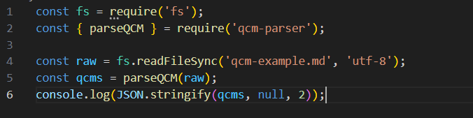
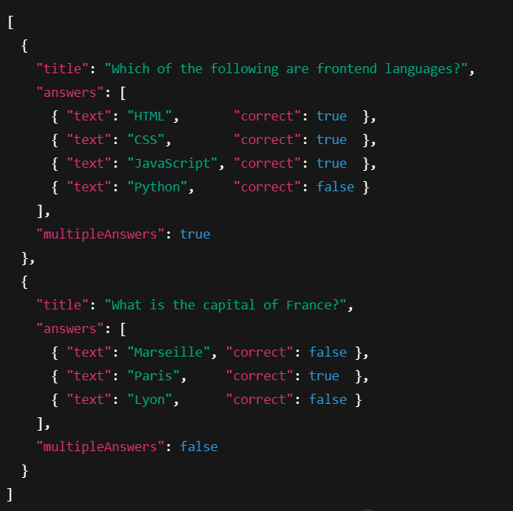

# qcm-parser

> A lightweight TypeScript/JavaScript library to parse Markdown-style QCM (Multiple-Choice Questionnaires) into JSON.

---

## 📦 Installation

Using npm:
```bash
npm install qcm-parser
```
Using yarn:
```bash
yarn add qcm-parser
```

## Quickstart


## Output


## 📖 API
parseQCM(markdown: string, options?: ParseOptions): Question[]
- markdown (string)
A Markdown-formatted string in which questions are prefixed with ## Q: and answers with - [ ] or - [x].

- options (ParseOptions, optional)

## 🔧 Configuration
By default, parseQCM will detect if a question has multiple correct answers and set multipleAnswers: true. If you want to force single-answer mode (QCU), pass:

```bash
const questions = parseQCM(markdown, { enforceSingle: true });
```
An error will be thrown if any question contains more than one [x].


MIT © [EmmanuelWill](https://github.com/EmmanuelWill)